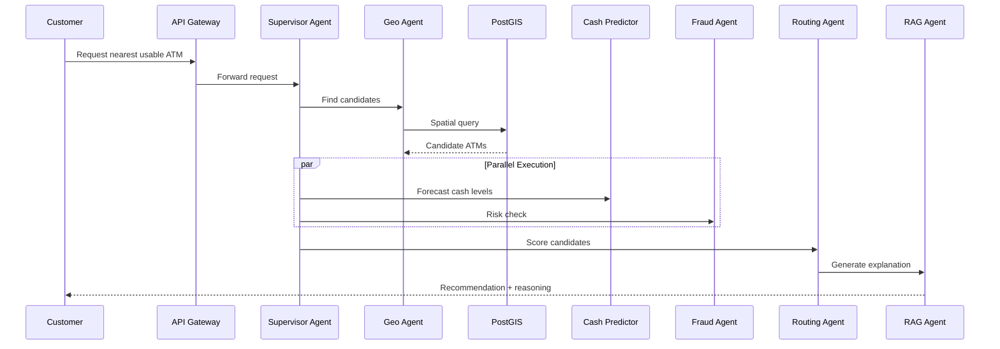

# 📘 Smart ATM Routing System — Complete Project Documentation

> **Version:** 2.0  
> **Status:** MVP → Agentic AI Platform  
> **Domain:** Banking / FinTech / Agentic AI  
> **Architecture Style:** Event-Driven, Multi-Agent, Microservices

---

## 📑 Table of Contents

1. [Executive Summary](#1-executive-summary)
2. [Problem Statement](#2-problem-statement)
3. [Solution Overview](#3-solution-overview)
4. [Business Value & KPIs](#4-business-value--kpis)
5. [System Architecture](#5-system-architecture)
6. [Multi-Agent AI Design](#6-multi-agent-ai-design)
7. [Data Layer & Persistence](#7-data-layer--persistence)
8. [API Design](#8-api-design)
9. [Event-Driven Backbone](#9-event-driven-backbone)
10. [Core Algorithms](#10-core-algorithms)
11. [Security & Compliance](#11-security--compliance)
12. [Observability & Monitoring](#12-observability--monitoring)
13. [DevOps & Deployment](#13-devops--deployment)
14. [Testing Strategy](#14-testing-strategy)
15. [Project Roadmap](#15-project-roadmap)
16. [Tech Stack Summary](#16-tech-stack-summary)
17. [Risk Assessment](#17-risk-assessment)
18. [Future Enhancements](#18-future-enhancements)

---

## 1. Executive Summary

The **Smart ATM Routing System** is an **Agentic AI-powered banking platform** that transforms how customers locate and use ATMs. Unlike traditional map-based ATM locators, this system uses a network of autonomous AI agents to recommend ATMs based on **real-time availability, predicted cash levels, queue length, fraud risk, and transaction success probability**.

The platform also operates as an **autonomous orchestrator** for the bank's ATM fleet — predicting cash depletion, optimizing replenishment routes, detecting fraud at the edge, and recommending strategic ATM placement.

### Key Differentiators
- 🤖 **Multi-Agent Orchestration** with LangGraph
- ⚡ **Event-Driven Architecture** (Kafka + CQRS + Event Sourcing)
- 🧠 **Predictive Intelligence** (Cash forecasting, queue prediction)
- 🛡️ **Edge Fraud Detection** with anomaly detection
- 📍 **Geospatial Optimization** with PostGIS
- 💬 **Explainable AI** via RAG-based reasoning

---

## 2. Problem Statement

### 2.1 Current Pain Points

| Pain Point | Impact |
|-----------|--------|
| Customer arrives at ATM that is offline/empty | Wasted time, frustration |
| ATM doesn't support requested service | Repeated trips |
| Long queues at popular ATMs | Customer dissatisfaction |
| Bank wastes fuel on unnecessary cash refills | Operational cost |
| Fraud detection happens after-the-fact | Financial losses |
| Static ATM placement decisions | Underutilized assets |

### 2.2 Stakeholders

- **Customers** — Need fast, reliable ATM access
- **Bank Operations** — Need cost-effective fleet management
- **Cash Logistics Teams** — Need optimized routing
- **Compliance Officers** — Need auditable AI decisions
- **Strategic Planners** — Need data-driven placement insights

---

## 3. Solution Overview

### 3.1 Core Capabilities

```
┌─────────────────────────────────────────────────────────────┐
│              SMART ATM ROUTING PLATFORM                     │
├─────────────────────────────────────────────────────────────┤
│  CUSTOMER-FACING                                             │
│    • Smart ATM recommendations                               │
│    • Natural language search ("ATM near me with 5000 EGP")  │
│    • Real-time queue & availability info                     │
│    • Explanation of why an ATM was chosen                    │
├─────────────────────────────────────────────────────────────┤
│  BANK-FACING (AUTONOMOUS)                                    │
│    • Predictive cash replenishment                          │
│    • Fraud detection & blocking                              │
│    • Geospatial placement optimization                       │
│    • Demand heatmaps & analytics                             │
└─────────────────────────────────────────────────────────────┘
```

### 3.2 High-Level Flow



---

## 4. Business Value & KPIs

### 4.1 Customer KPIs

| Metric | Baseline | Target |
|--------|----------|--------|
| Failed ATM trips | 25% | < 3% |
| Avg. transaction time | 8 min | 4 min |
| Customer satisfaction (NPS) | 35 | 65+ |
| Complaints related to ATMs | High | -70% |

### 4.2 Operational KPIs

| Metric | Baseline | Target |
|--------|----------|--------|
| Cash logistics cost | 100% | -30% |
| ATM uptime | 92% | 98%+ |
| Fraud detection latency | minutes | < 500ms |
| ATM utilization rate | 60% | 85%+ |

---

## 5. System Architecture

### 5.1 Layered Architecture

```
┌────────────────────────────────────────────────────────────┐
│  LAYER 1: PRESENTATION                                      │
│  Mobile App │ Web Portal │ Admin Dashboard                  │
└────────────────────────────────────────────────────────────┘
                          ↕ HTTPS / WSS
┌────────────────────────────────────────────────────────────┐
│  LAYER 2: API GATEWAY (Spring Cloud Gateway / Kong)         │
│  Auth (JWT/OAuth2) │ Rate Limit │ Request Validation        │
└────────────────────────────────────────────────────────────┘
                          ↕ gRPC / REST
┌────────────────────────────────────────────────────────────┐
│  LAYER 3: APPLICATION SERVICES                              │
│  ┌────────────────┐  ┌────────────────┐  ┌──────────────┐  │
│  │ ATM Service    │  │ Routing Service│  │ Admin Service│  │
│  │ (Spring Boot)  │  │ (Python)       │  │ (Spring Boot)│  │
│  └────────────────┘  └────────────────┘  └──────────────┘  │
└────────────────────────────────────────────────────────────┘
                          ↕
┌────────────────────────────────────────────────────────────┐
│  LAYER 4: AI ORCHESTRATION (Python + LangGraph)             │
│  Supervisor → [Geo, Cash, Fraud, Routing, RAG] Agents       │
└────────────────────────────────────────────────────────────┘
                          ↕
┌────────────────────────────────────────────────────────────┐
│  LAYER 5: EVENT BUS & STATE                                 │
│  Apache Kafka │ Redis (Cache + State) │ Redis Streams       │
└────────────────────────────────────────────────────────────┘
                          ↕
┌────────────────────────────────────────────────────────────┐
│  LAYER 6: PERSISTENCE (Polyglot)                            │
│  PostgreSQL+PostGIS │ TimescaleDB │ Qdrant │ MinIO          │
└────────────────────────────────────────────────────────────┘
```

### 5.2 Microservices Breakdown

| Service | Language | Responsibility |
|---------|----------|---------------|
| **API Gateway** | Java/Spring | Auth, routing, rate limiting |
| **ATM Service** | Java/Spring Boot | CRUD for ATMs, status updates |
| **Routing Service** | Python/FastAPI | Customer-facing recommendation API |
| **AI Orchestrator** | Python/LangGraph | Multi-agent coordination |
| **Cash Predictor** | Python | ML forecasting service |
| **Fraud Service** | Python | Real-time anomaly detection |
| **Notification Service** | Node.js | SMS/Push/WebSocket |
| **Analytics Service** | Python | Dashboards, heatmaps |

---

## 6. Multi-Agent AI Design

### 6.1 Agent Catalog

#### 🎯 Supervisor Agent
- **Role:** Orchestrator and intent router
- **Implementation:** LangGraph `StateGraph` with conditional edges
- **Pattern:** Hybrid (rule-based fast path + LLM for complex queries)

#### 📍 Geo-Spatial Agent
- **Role:** Find candidate ATMs within radius
- **Tools:**
  - `find_atms_within_radius(lat, lon, radius)` — PostGIS `ST_DWithin`
  - `calculate_route_distance(...)` — OSRM API
- **Output:** Ranked list by real driving distance

#### 💰 Cash Prediction Agent
- **Role:** Forecast cash availability at customer arrival time
- **Model:** Prophet / LSTM on TimescaleDB historical data
- **Features:** Day-of-month, payday proximity, holidays, location type, historical withdrawal rate

#### 🚦 Behavioral Routing Agent
- **Role:** Compute success probability for each candidate
- **Formula:**
  $$P_{success} = w_1 \cdot P_{cash} + w_2 \cdot (1 - P_{queue}) + w_3 \cdot P_{online} - w_4 \cdot \text{traffic\_penalty}$$

#### 🛡️ Fraud Detection Agent
- **Role:** Real-time anomaly detection
- **Model:** Isolation Forest + Autoencoder ensemble
- **Triggers:** Velocity checks, geo-impossibility, behavioral biometrics

#### 💬 RAG Explanation Agent
- **Role:** Generate natural language reasoning
- **Vector Store:** Qdrant
- **Sources:** Bank policies, ATM history, complaint records

#### 🚚 Replenishment Agent (Background)
- **Role:** Autonomous cash logistics trigger
- **Trigger:** Subscribed to `atm.cash.events` Kafka topic
- **Action:** Calls Cash Logistics API with optimized routes

### 6.2 Shared State Schema

```python
from typing import TypedDict, Annotated
from langgraph.graph.message import add_messages

class ATMState(TypedDict):
    # Input
    customer_id: str
    customer_location: tuple[float, float]
    service_type: str  # WITHDRAWAL, DEPOSIT, TRANSFER, etc.
    amount: float
    radius_km: float
    
    # Intermediate
    candidate_atms: list[dict]
    cash_predictions: dict[str, float]
    fraud_score: float
    queue_estimates: dict[str, int]
    
    # Output
    recommendation: dict
    alternatives: list[dict]
    explanation: str
    
    # Meta
    messages: Annotated[list, add_messages]
    trace_id: str
    decision_path: list[str]
```

### 6.3 LangGraph Workflow

```python
from langgraph.graph import StateGraph, END

workflow = StateGraph(ATMState)

workflow.add_node("supervisor", supervisor_agent)
workflow.add_node("geo_search", geo_agent)
workflow.add_node("fraud_check", fraud_agent)
workflow.add_node("cash_predict", cash_agent)
workflow.add_node("behavioral_route", routing_agent)
workflow.add_node("rag_explain", rag_agent)
workflow.add_node("respond", final_responder)

workflow.set_entry_point("supervisor")
workflow.add_edge("supervisor", "geo_search")

# Parallel fan-out
workflow.add_edge("geo_search", "fraud_check")
workflow.add_edge("geo_search", "cash_predict")

# Fan-in
workflow.add_edge("fraud_check", "behavioral_route")
workflow.add_edge("cash_predict", "behavioral_route")

# Conditional routing
workflow.add_conditional_edges(
    "behavioral_route",
    lambda s: "blocked" if s["fraud_score"] > 0.85 else "explain",
    {"blocked": "respond", "explain": "rag_explain"}
)

workflow.add_edge("rag_explain", "respond")
workflow.add_edge("respond", END)

app = workflow.compile(checkpointer=RedisCheckpointer())
```

---

## 7. Data Layer & Persistence

### 7.1 Polyglot Persistence Strategy

| Database | Purpose | Why |
|----------|---------|-----|
| **PostgreSQL + PostGIS** | ATM master data, transactions, geospatial queries | ACID + spatial indexing |
| **TimescaleDB** | Time-series (withdrawals, cash levels) | Optimized for time-based analytics |
| **Qdrant** | RAG embeddings | Fast semantic search |
| **Redis** | Session, cache, agent state, distributed locks | Sub-millisecond reads |
| **MinIO/S3** | ML model artifacts, ATM images | Object storage |
| **Elasticsearch** | Logs, audit trail | Full-text search |

### 7.2 Core Schema (PostgreSQL)

```sql
CREATE EXTENSION postgis;

CREATE TABLE atms (
    id              UUID PRIMARY KEY,
    name            VARCHAR(200) NOT NULL,
    address         TEXT,
    location        GEOGRAPHY(POINT, 4326) NOT NULL,
    status          VARCHAR(20) CHECK (status IN ('ONLINE','OFFLINE','MAINTENANCE')),
    cash_level      DECIMAL(15,2),
    max_capacity    DECIMAL(15,2),
    services        TEXT[],
    bank_branch     VARCHAR(100),
    last_refill_at  TIMESTAMPTZ,
    created_at      TIMESTAMPTZ DEFAULT NOW(),
    updated_at      TIMESTAMPTZ DEFAULT NOW()
);

CREATE INDEX idx_atms_location ON atms USING GIST(location);
CREATE INDEX idx_atms_status   ON atms(status);
CREATE INDEX idx_atms_services ON atms USING GIN(services);

CREATE TABLE search_history (
    id              BIGSERIAL PRIMARY KEY,
    customer_id     UUID,
    location        GEOGRAPHY(POINT, 4326),
    service_type    VARCHAR(50),
    amount          DECIMAL(15,2),
    recommended_atm UUID REFERENCES atms(id),
    response_time_ms INT,
    created_at      TIMESTAMPTZ DEFAULT NOW()
);
```

### 7.3 Time-Series Schema (TimescaleDB)

```sql
CREATE TABLE atm_cash_events (
    time            TIMESTAMPTZ NOT NULL,
    atm_id          UUID NOT NULL,
    event_type      VARCHAR(20),  -- WITHDRAWAL, DEPOSIT, REFILL
    amount          DECIMAL(15,2),
    cash_after      DECIMAL(15,2)
);

SELECT create_hypertable('atm_cash_events', 'time');
CREATE INDEX ON atm_cash_events (atm_id, time DESC);
```

---

## 8. API Design

### 8.1 Customer Endpoints

#### `POST /api/v1/atms/recommend`

**Request:**
```json
{
  "latitude": 30.0444,
  "longitude": 31.2357,
  "serviceType": "WITHDRAWAL",
  "amount": 5000,
  "radiusKm": 5,
  "preferences": {
    "maxQueueMinutes": 10,
    "preferredBank": "NBE"
  }
}
```

**Response:**
```json
{
  "traceId": "abc-123",
  "recommendedATM": {
    "id": "atm-001",
    "name": "NBE Tahrir ATM",
    "address": "Tahrir Square, Cairo",
    "distanceKm": 1.2,
    "etaMinutes": 6,
    "status": "ONLINE",
    "cashLevelStatus": "SUFFICIENT",
    "predictedQueueMinutes": 2,
    "successProbability": 0.94,
    "services": ["WITHDRAWAL", "DEPOSIT"]
  },
  "alternatives": [
    {
      "id": "atm-002",
      "name": "NBE Garden City ATM",
      "distanceKm": 2.3,
      "successProbability": 0.88
    }
  ],
  "explanation": "We recommend NBE Tahrir because it's the closest ATM with sufficient cash and a low queue time.",
  "responseTimeMs": 287
}
```

### 8.2 Admin Endpoints

| Method | Endpoint | Purpose |
|--------|----------|---------|
| POST | `/api/v1/admin/atms` | Create ATM |
| PUT | `/api/v1/admin/atms/{id}` | Update ATM |
| DELETE | `/api/v1/admin/atms/{id}` | Soft-delete ATM |
| PATCH | `/api/v1/admin/atms/{id}/status` | Update status |
| PATCH | `/api/v1/admin/atms/{id}/cash` | Update cash level |
| GET | `/api/v1/admin/analytics/heatmap` | Demand heatmap |
| GET | `/api/v1/admin/predictions/replenishment` | Refill schedule |

### 8.3 Streaming Endpoints

- `WS /ws/atms/{id}/status` — Real-time status updates
- `WS /ws/customer/{id}/recommendations` — Push notifications

---

## 9. Event-Driven Backbone

### 9.1 Kafka Topics

| Topic | Producer | Consumer | Purpose |
|-------|----------|----------|---------|
| `atm.cash.events` | ATM Service | Cash Predictor, Replenishment Agent | Cash level changes |
| `atm.status.events` | ATM Service | Routing Service | Online/offline transitions |
| `customer.search.events` | Routing Service | Analytics, ML training | Customer searches |
| `fraud.alerts` | Fraud Agent | Notification, Compliance | Detected anomalies |
| `replenishment.requests` | Replenishment Agent | Cash Logistics | Refill triggers |

### 9.2 Event Schema (Avro Example)

```json
{
  "type": "record",
  "name": "CashEvent",
  "fields": [
    {"name": "eventId", "type": "string"},
    {"name": "atmId", "type": "string"},
    {"name": "eventType", "type": {"type": "enum", "symbols": ["WITHDRAWAL", "DEPOSIT", "REFILL"]}},
    {"name": "amount", "type": "double"},
    {"name": "cashAfter", "type": "double"},
    {"name": "timestamp", "type": "long"}
  ]
}
```

### 9.3 CQRS + Event Sourcing

- **Commands** → Write side (ATM Service) → Append to Kafka
- **Events** → Replayed to build read models (Materialized Views in Redis/Postgres)
- **Benefit:** Full audit trail, time-travel debugging, replay-able state

---

## 10. Core Algorithms

### 10.1 Geospatial Search

```sql
SELECT id, name, ST_Distance(location, :customer_point) AS distance_m
FROM atms
WHERE status = 'ONLINE'
  AND :service = ANY(services)
  AND ST_DWithin(location, :customer_point, :radius_meters)
ORDER BY distance_m
LIMIT 20;
```

### 10.2 Sliding Window Anomaly Detection

```python
from collections import deque
from datetime import datetime, timedelta

class SlidingWindowDetector:
    def __init__(self, window_seconds=120, threshold=50):
        self.window = deque()
        self.window_seconds = window_seconds
        self.threshold = threshold
    
    def add_event(self, event):
        now = datetime.utcnow()
        self.window.append((now, event))
        cutoff = now - timedelta(seconds=self.window_seconds)
        while self.window and self.window[0][0] < cutoff:
            self.window.popleft()
        return len(self.window) > self.threshold  # Anomaly!
```

### 10.3 Cash Depletion Prediction

```python
from prophet import Prophet
import pandas as pd

def predict_cash_depletion(atm_id: str, current_cash: float):
    history = fetch_withdrawal_history(atm_id, days=90)
    df = pd.DataFrame(history).rename(columns={"time": "ds", "amount": "y"})
    
    model = Prophet(daily_seasonality=True, weekly_seasonality=True)
    model.add_country_holidays(country_name='EG')
    model.fit(df)
    
    future = model.make_future_dataframe(periods=24, freq='H')
    forecast = model.predict(future)
    
    cumulative = forecast['yhat'].cumsum()
    depletion_idx = (cumulative >= current_cash).idxmax()
    return forecast.iloc[depletion_idx]['ds']
```

### 10.4 Success Probability Scoring

```python
def score_atm(atm: dict, context: dict) -> float:
    p_cash = 1.0 if atm['predicted_cash'] >= context['amount'] else 0.0
    p_queue = min(atm['queue_minutes'] / 30, 1.0)
    p_online = 1.0 if atm['status'] == 'ONLINE' else 0.0
    traffic = atm['traffic_penalty']  # 0-1
    
    return (
        0.40 * p_cash +
        0.25 * (1 - p_queue) +
        0.25 * p_online -
        0.10 * traffic
    )
```

---

## 11. Security & Compliance

### 11.1 Authentication & Authorization

- **OAuth2 + JWT** for customer & admin auth
- **mTLS** between microservices
- **Role-Based Access Control (RBAC):** `CUSTOMER`, `ADMIN`, `OPERATOR`, `AUDITOR`

### 11.2 Data Protection

| Data | Protection |
|------|------------|
| PII (customer info) | AES-256 encryption at rest |
| Card numbers | **Never stored**; tokenized via PCI vault |
| Location data | Anonymized after 30 days |
| API traffic | TLS 1.3 |

### 11.3 Compliance Checklist

- ✅ **PCI-DSS** — No card data in logs/state
- ✅ **GDPR** — Right to be forgotten APIs
- ✅ **Central Bank of Egypt regulations** — Audit trail retention
- ✅ **AI Explainability** — Every AI decision has stored reasoning

### 11.4 AI-Specific Security

- **Prompt Injection Defense** — Input sanitization for LLM calls
- **Rate Limiting per Agent** — Prevent runaway loops
- **Token Budget Caps** — Per-request cost ceiling
- **Output Validation** — Schema-enforce all LLM responses

---

## 12. Observability & Monitoring

### 12.1 Three Pillars

| Pillar | Tool | Purpose |
|--------|------|---------|
| **Metrics** | Prometheus + Grafana | System health, KPIs |
| **Logs** | ELK Stack (Elasticsearch + Logstash + Kibana) | Searchable logs |
| **Traces** | OpenTelemetry + Jaeger | Distributed request tracing |

### 12.2 Key Dashboards

1. **System Health** — Latency, error rates, throughput
2. **AI Agent Performance** — Per-agent latency, token usage, success rate
3. **Business KPIs** — Recommendations served, success rate
4. **ATM Fleet** — Online %, cash distribution, demand heatmap

### 12.3 Alerting Rules

```yaml
- alert: HighRecommendationLatency
  expr: histogram_quantile(0.95, recommendation_latency_seconds) > 1.0
  for: 5m
  severity: warning

- alert: AgentFailureRate
  expr: rate(agent_errors_total[5m]) > 0.05
  for: 2m
  severity: critical

- alert: ATMFleetDegraded
  expr: (count(atm_status="ONLINE") / count(atm_status)) < 0.9
  severity: critical
```

---

## 13. DevOps & Deployment

### 13.1 Infrastructure as Code

- **Terraform** for cloud provisioning
- **Helm Charts** for Kubernetes deployment
- **GitHub Actions / GitLab CI** for pipelines

### 13.2 Environments

| Environment | Purpose |
|-------------|---------|
| `dev` | Local development with Docker Compose |
| `staging` | Pre-production with simulated traffic |
| `production` | Live system with HA setup |

### 13.3 Docker Compose (Development)

```yaml
version: '3.9'
services:
  postgres:
    image: postgis/postgis:15-3.3
    environment:
      POSTGRES_PASSWORD: dev
    ports: ["5432:5432"]
  
  timescaledb:
    image: timescale/timescaledb:latest-pg15
    ports: ["5433:5432"]
  
  redis:
    image: redis:7-alpine
    ports: ["6379:6379"]
  
  kafka:
    image: confluentinc/cp-kafka:7.5.0
    ports: ["9092:9092"]
  
  qdrant:
    image: qdrant/qdrant
    ports: ["6333:6333"]
  
  api-gateway:
    build: ./services/gateway
    ports: ["8080:8080"]
  
  ai-orchestrator:
    build: ./services/orchestrator
    depends_on: [redis, kafka, qdrant]
```

### 13.4 Kubernetes Strategy

- **Horizontal Pod Autoscaling** based on CPU + custom metrics
- **PgBouncer** for connection pooling
- **Service Mesh (Istio)** for mTLS and traffic control
- **Blue/Green deployments** for zero-downtime releases

---

## 14. Testing Strategy

### 14.1 Test Pyramid

```
                    ┌──────────────┐
                    │   E2E (5%)   │   Cypress / Playwright
                    └──────────────┘
                ┌──────────────────────┐
                │  Integration (15%)   │   TestContainers
                └──────────────────────┘
        ┌──────────────────────────────────┐
        │      Unit Tests (80%)            │   PyTest / JUnit
        └──────────────────────────────────┘
```

### 14.2 AI-Specific Testing

| Test Type | Approach |
|-----------|----------|
| **Agent Behavior** | Golden datasets with expected outputs |
| **Prompt Regression** | Snapshot testing for LLM responses |
| **Hallucination Detection** | Validate outputs against ground truth |
| **Load Testing** | Locust simulating 1000+ concurrent searches |
| **Chaos Engineering** | Kill agents/databases randomly |

### 14.3 Sample Test

```python
def test_supervisor_routes_to_geo_first():
    state = ATMState(customer_location=(30.04, 31.23), service_type="WITHDRAWAL", amount=5000)
    result = supervisor_agent.invoke(state)
    assert "geo_search" in result["decision_path"]

def test_fraud_blocks_recommendation():
    state = create_high_risk_state()
    result = workflow.invoke(state)
    assert result["recommendation"] is None
    assert result["fraud_score"] > 0.85
```

---

## 15. Project Roadmap

### Phase 1: Foundation (Weeks 1-2)
- [x] Project scaffolding
- [ ] PostgreSQL + PostGIS schema
- [ ] ATM CRUD APIs
- [ ] Basic geo-search endpoint

### Phase 2: Core Intelligence (Weeks 3-5)
- [ ] LangGraph supervisor + geo agent
- [ ] Cash prediction model (Prophet)
- [ ] Behavioral routing scorer
- [ ] Redis caching layer

### Phase 3: Event-Driven Backbone (Weeks 6-8)
- [ ] Kafka cluster setup
- [ ] Event sourcing for cash events
- [ ] Replenishment Agent
- [ ] CQRS read models

### Phase 4: Trust & Explainability (Weeks 9-10)
- [ ] Fraud Detection Agent
- [ ] Qdrant + RAG explanation
- [ ] Audit trail system

### Phase 5: Scale & Polish (Weeks 11-12)
- [ ] Kubernetes deployment
- [ ] Load testing
- [ ] Mobile app integration
- [ ] Admin dashboard

---

## 16. Tech Stack Summary

| Layer | Technology |
|-------|-----------|
| **Frontend (Mobile)** | Flutter / React Native |
| **Frontend (Web Admin)** | React + TypeScript |
| **API Gateway** | Spring Cloud Gateway |
| **Backend Services** | Spring Boot (Java 21), FastAPI (Python 3.11) |
| **AI Orchestration** | LangGraph, LangChain |
| **LLM Providers** | OpenAI / Anthropic / Local (Ollama) |
| **ML Models** | Prophet, Scikit-learn, PyTorch |
| **Databases** | PostgreSQL+PostGIS, TimescaleDB, Redis, Qdrant |
| **Event Bus** | Apache Kafka + Schema Registry |
| **Object Storage** | MinIO / AWS S3 |
| **Container Runtime** | Docker, Kubernetes |
| **Service Mesh** | Istio |
| **Observability** | Prometheus, Grafana, Jaeger, ELK |
| **CI/CD** | GitHub Actions, ArgoCD |
| **IaC** | Terraform, Helm |

---

## 17. Risk Assessment

| Risk | Likelihood | Impact | Mitigation |
|------|-----------|--------|------------|
| LLM API outage | Medium | High | Circuit breaker + fallback rules |
| Kafka cluster failure | Low | Critical | Multi-broker replication |
| Inaccurate cash predictions | Medium | Medium | Conservative safety margin + retraining |
| Fraud false positives | Medium | High | Human-in-the-loop for high-stakes decisions |
| Token cost explosion | High | Medium | Hard budget caps + caching |
| Privacy breach | Low | Critical | Encryption + anonymization + audits |
| Cold-start ML models | High | Low | Use pre-trained + synthetic data initially |

---

## 18. Future Enhancements

### Short-Term (3-6 months)
- 🗺️ Real map integration (Google Maps / Mapbox)
- 📱 Push & SMS notifications
- 🌐 Multi-language NLU (Arabic, English, French)
- 📊 Advanced demand heatmaps

### Medium-Term (6-12 months)
- 🤖 Voice assistant integration
- 🔮 ATM hardware failure prediction (predictive maintenance)
- 🎯 Personalized recommendations based on customer history
- 🔗 Inter-bank ATM network sharing

### Long-Term (1-2 years)
- 🌍 Multi-country deployment
- 🏬 Automated ATM placement negotiation agent
- 🔐 Biometric face verification at ATMs
- 🧠 Federated learning across bank branches
- 💎 Tokenized loyalty rewards for ATM usage

---

## 📌 Appendices

### A. Glossary

| Term | Definition |
|------|-----------|
| **Agentic AI** | AI systems that take autonomous actions toward goals |
| **CQRS** | Command Query Responsibility Segregation |
| **Event Sourcing** | Storing state changes as immutable events |
| **PostGIS** | Spatial extension for PostgreSQL |
| **RAG** | Retrieval-Augmented Generation |
| **Sliding Window** | Algorithm tracking recent events in fixed time frame |

### B. References

- LangGraph Documentation: https://langchain-ai.github.io/langgraph/
- PostGIS Documentation: https://postgis.net/
- Apache Kafka: https://kafka.apache.org/
- Prophet (Forecasting): https://facebook.github.io/prophet/
- Event Sourcing Pattern: https://martinfowler.com/eaaDev/EventSourcing.html

### C. Contact & Contribution

- **Maintainer:** [Your Team]
- **License:** Proprietary / MIT (TBD)
- **Contributing:** See `CONTRIBUTING.md`

---

> 🎓 **Capstone-Ready Note:** This document covers product vision, architectural depth, AI design, data engineering, DevOps, security, and roadmap — all the dimensions evaluators look for in a senior-level project. Pair it with working code, demo videos, and a sequence diagram pack to maximize impact.
